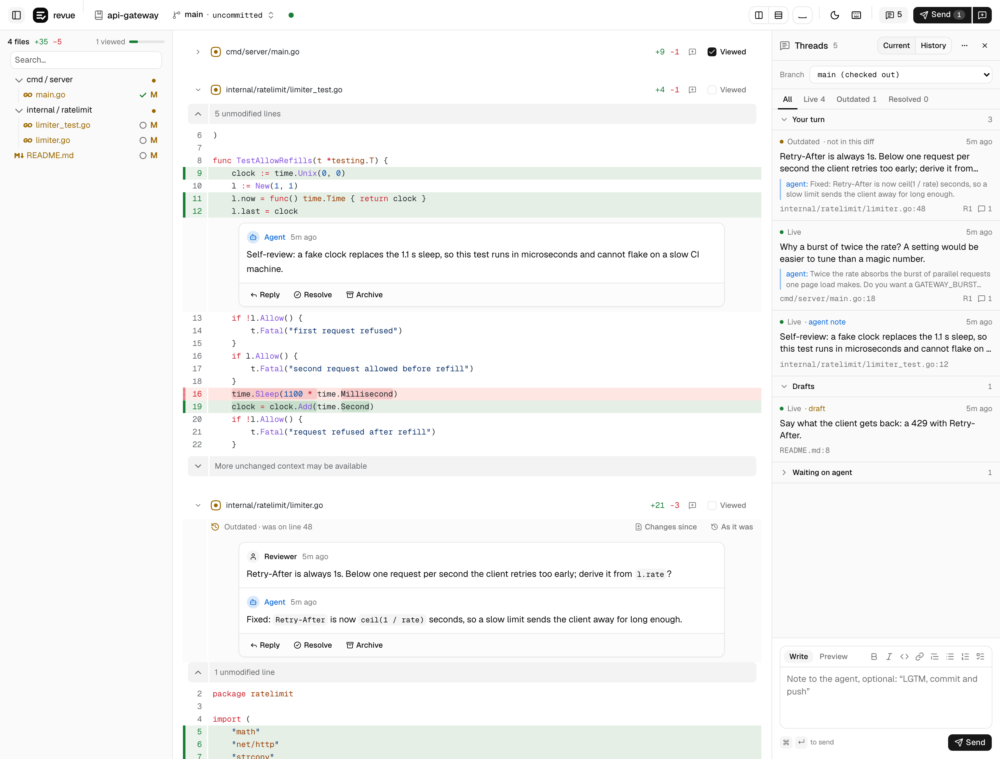

# revue

Review what your coding agent wrote the way you review a pull request, without pushing anything. revue shows the agent's changes as a GitHub-style diff in your browser, and the agent reads your comments and answers them through a small CLI. Everything stays on one machine: no remote, no accounts.

<picture>
  <source media="(prefers-color-scheme: dark)" srcset="docs/screenshot-dark.png">
  
</picture>

## Install

Binaries for Linux and macOS, amd64 and arm64, are on the [releases page](https://github.com/rphf/revue/releases). See [docs/install.md](docs/install.md) for download one-liners and building from source.

## Why review through revue

- **No branch, no PR, no commit.** The page follows the agent's working tree live. You review the code as it is now and commit when it is right.
- **One handoff each way.** The agent can annotate its change before you read it. You send all your comments at once, with a note, and the agent's `revue wait` returns with exactly what to act on.
- **You see what the agent did about each comment.** Threads are sorted by whose turn it is. A thread whose code the agent rewrote stays under its file, with the old code and the change one click away, and "Since my last send" shows only what changed since.
- **Cheap for the agent.** Compact text output, with the quoted code in every thread: no diff to read.

## Quick start

1. In a git repository with changes, run `revue`. The browser opens on the working tree against HEAD.
2. Comment on lines, then press Send, with a note if you like.
3. The agent reads it with `revue feedback` or `revue wait` and answers with `revue reply`; its edits and answers show up live. Put [the agent loop](docs/agent-loop.md) in its instructions.

`revue open` accepts the same arguments as `git diff`. Examples:

```sh
revue                         # working tree against HEAD, untracked files included
revue open -- web docs        # the same, limited to paths under web/ and docs/
revue open --staged           # index
revue open main               # working tree against main
revue open main...HEAD        # this branch against its merge base with main
revue open abc123 def456      # two commits
```

## How it works

The page shows one diff, named by its `git diff` arguments, and keeps it current. A thread remembers the code it was written on: it follows its hunk as code moves, goes outdated when that hunk changes, and comes back if the code does. The agent can reply; only you resolve.

A send records the working tree under `refs/revue/last-send`, a commit on no branch that a plain `git push` leaves behind. Threads belong to their branch, and a commit ends the conversation as a merge does on GitHub: its threads land, and History keeps them. Comments are GitHub-flavored markdown, and markdown files have a rendered view.

## Documentation

- [Install](docs/install.md): download one-liners for a shell or a Dockerfile, building from source.
- [CLI reference](docs/cli.md): every command, what a diff argument means, exit codes.
- [The agent loop](docs/agent-loop.md): the steps to put in an agent's instructions.
- [Configuration](docs/configuration.md): environment variables, running inside a container, data location.
- [Development](docs/development.md): building from source, make targets, toolchain, lint rules, CI.
- [Releasing](docs/releasing.md): tags, versions from commit types, the Release workflow.

Design notes live in `docs/plans/` and `docs/research/`.

## License

MIT, see `LICENSE`.
