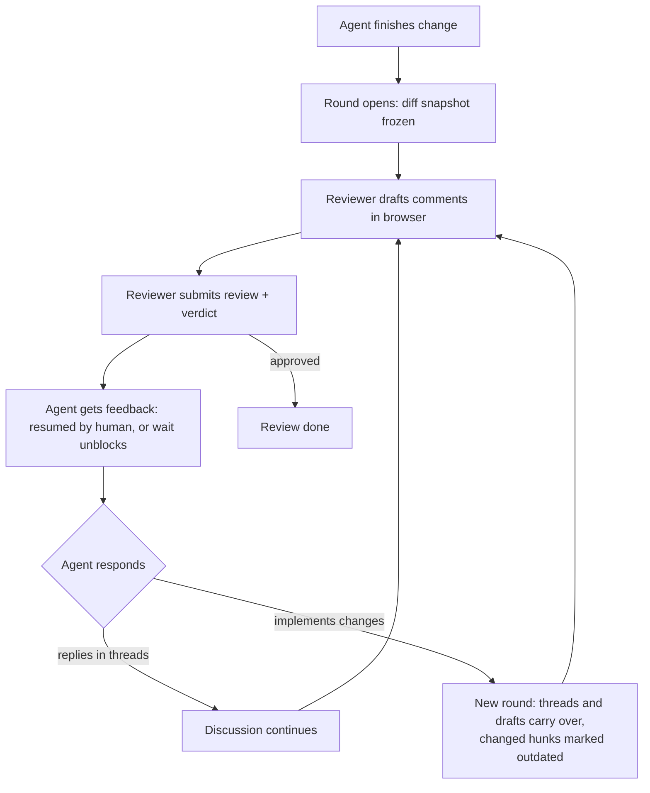
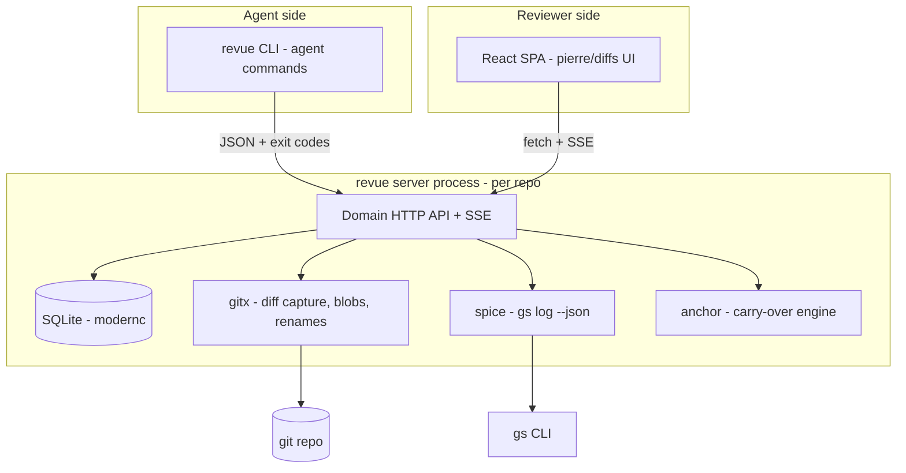
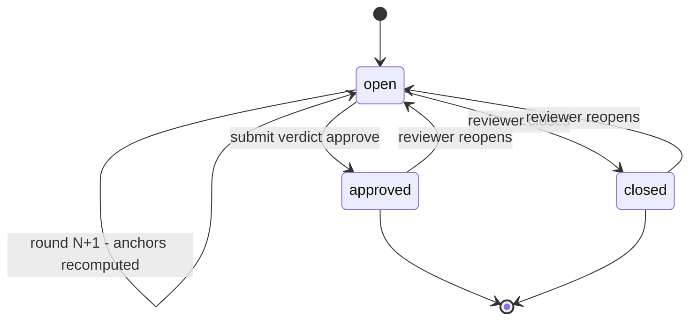
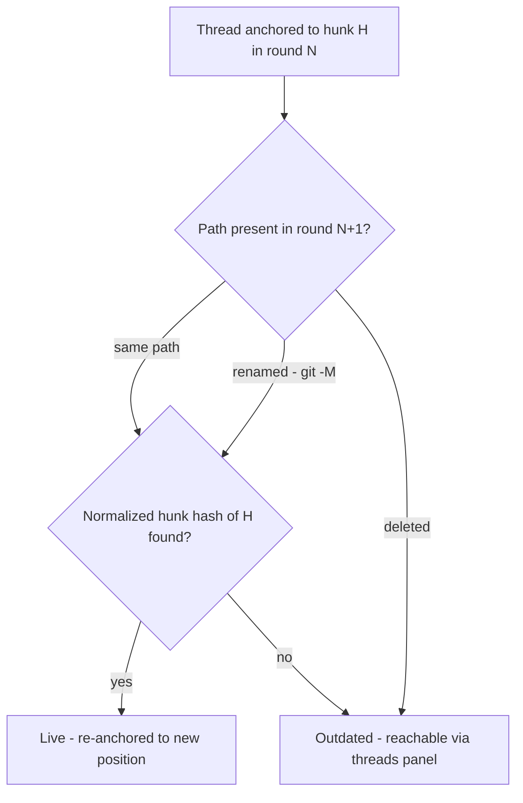

# Revue - Plan

## Goal Capsule

- **Objective:** Ship revue v1 — a fully local, open-source code-review tool where a human reviews AI-agent-written diffs in a GitHub-style browser UI and the agent consumes that feedback through a CLI, with first-class git-spice stack support.
- **Product authority:** The Product Contract below (2026-07-03 brainstorm, clarified by planning research — see the preservation note in the Planning Contract). Raphael is the sole decision-maker.
- **Execution profile:** Greenfield repo. Three phased milestones: core review loop, rounds/anchoring, stacks + export + release. The anchoring engine is built test-first.
- **Landing strategy (global):** Everything stays local — no remote, no pushes, no PRs. Work lands as a git-spice stack with one branch per implementation unit; defects found in earlier units are patched with fixup commits on the owning branch followed by an upstack restack. Full mechanics in the Planning Contract's Landing Strategy section.
- **Stop conditions:** Surface anything that changes Product Contract behavior or contradicts a Key Technical Decision instead of guessing. Details the plan leaves open are implementer judgment.
- **Open blockers:** None.

---

## Product Contract

### Summary

Revue is a Go CLI that opens a browser UI to review any diff `git diff` can express — file tree on the left, diff with inline comment threads on the right, GitHub-style. The same CLI is the agent's interface: cursor-based reads of threads and feedback, in-thread replies, and an optional blocking wait. The primary loop is human-resume: the agent requests review and ends its turn; the reviewer submits; the agent reads the feedback when resumed. Reviews iterate in snapshot rounds with content-anchored threads, so git-spice restacks don't invalidate feedback on unchanged code.

### Problem Frame

Coding agents produce a high volume of local diffs, and reviewing them today means reading raw diffs in a terminal or editor. Feedback travels back to the agent as pasted prose that loses line anchoring, and there is no record of what was reviewed, contested, or resolved across iterations. Existing local diff-review tools (diffx, diffity, crit) cover browser-based diff viewing with comments, but none supports git-spice stacks, and none models the review as rounds that survive the agent rewriting the code under review. Raphael also wants an owned codebase as the platform for review features he plans beyond v1.

### Key Decisions

- **Agent-agnostic CLI, human-resume first.** Revue never spawns or manages agents. The agent's primitive is a cursor-based read ("everything since X"); the primary documented loop is the agent ending its turn after requesting review and reading feedback when the human resumes it. `revue wait` is an optional blocking convenience on the same primitive for unattended runs — resumable, because agent harnesses cap shell-command duration well below human review time.
- **Snapshot rounds with GitHub-parity thread semantics.** Every round freezes the diff it was reviewed against (a working tree has no stable SHA, so the snapshot is the anchor). Threads carry across rounds anchored to diff content: an unchanged hunk keeps its threads live — including through a rebase or git-spice restack that only changes the base — while a changed hunk marks its threads outdated. History is never lost.
- **Per-branch stack reviews.** In a git-spice stack, each branch is its own review, mirroring git-spice's branch-equals-PR model, with navigation across the stack. No whole-stack mega-review.
- **GitHub-shaped data model without GitHub integration.** Reviews, rounds, threads, comments, verdicts, and resolution state follow GitHub's review model so PR sync can land later without a remodel. No GitHub API code in v1.
- **Plain Go core: SQLite via modernc.org/sqlite, a thin domain-shaped API, SSE for live updates.** PocketBase was rejected: its strengths (auth, generic CRUD, admin UI) sit where this product has no need, and the hard work (snapshots, anchoring, outdated computation) gets no help from it. Files-only storage was rejected for its drag on planned future features; its transparency survives as an export command.
- **Frontend: React with `@pierre/diffs`; custom file tree.** `@pierre/diffs` (Apache-2.0, v1.2.x) ships React bindings, Shiki highlighting, virtualization, and a line-annotation framework that maps directly to comment threads. `@pierre/trees` is not used: it is a breaking-change beta, and diffx — the closest prior art — replaced it with a ~100-line custom tree. Revue builds its own tree component.
- **Open-source from day one.** Public repo, README onboarding, versioned releases with cross-compiled darwin/linux binaries. This makes CGO-free builds a hard constraint, which the modernc SQLite driver satisfies.
- **Name: revue.** French for review, `passer en revue`. Verified 2026-07-03: no Homebrew formula exists; the only same-domain GitHub project (istarkov/revue, 222 stars) is dormant with zero releases. See docs/research/2026-07-03-name-check.md.

### Actors

- A1. **Reviewer** — Raphael (later, any open-source user): opens reviews in the browser, drafts comments, submits with a verdict, resolves threads, closes or reopens reviews.
- A2. **Coding agent** — any local agent (Claude Code or other) that can run shell commands: requests reviews, reads feedback via cursor or wait, replies in threads, implements changes, signals new rounds.

### Key Flows

- F1. **Review round loop**
  - **Trigger:** A2 finishes a change and requests review, or A1 opens a review on a diff.
  - **Steps:** Revue snapshots the diff and opens the browser UI; A1 reads the diff and drafts line-anchored comments; A1 submits the review with a verdict; A2 receives the feedback — by being resumed by A1 and reading the cursor, or by an active `wait` unblocking; A2 replies in threads and/or implements changes; A2 signals the next round; threads and drafts carry over per content anchoring.
  - **Outcome:** Rounds repeat until A1 approves (or closes).
  - **Covers:** R4, R5, R8, R9, R10, R11, R12, R13, R21.

- F2. **Stack review**
  - **Trigger:** A1 opens a review in a repo with a tracked git-spice stack.
  - **Steps:** Revue enumerates the stack; A1 steps through per-branch reviews bottom-up with stack navigation; a downstack fix restacks upstack branches; threads on upstack branches whose patch content is unchanged stay live, only genuinely changed hunks go outdated.
  - **Outcome:** Every branch in the stack reviewed without re-litigating unchanged code.
  - **Covers:** R9, R15, R16.
- F3. **Ad-hoc diff review**
  - **Trigger:** A1 wants to inspect any diff without an agent in the loop.
  - **Steps:** A1 opens a review from git-diff-style arguments; reviews in the browser; verdict optional; optionally exports the review as markdown.
  - **Outcome:** Revue works as a standalone diff viewer with notes.
  - **Covers:** R1, R14.

### Requirements

**Diff sources and viewing**

- R1. A review can open from anything `git diff` can express — working tree, staged, a commit, a commit range, branch-to-branch — passed as CLI arguments. Working-tree reviews also include untracked (non-ignored) files, presented as added files.
- R2. The browser UI shows a file tree on the left and the diff on the right, with unified and split views, syntax highlighting, and GitHub-style visual conventions.
- R3. Large diffs render without jank (virtualized rendering).
- R24. Binary files display as change-stat entries only; line comments do not apply to them in v1.
- R25. The reviewer can expand hunk context inline; expanded lines are served from the round's frozen snapshot, never the live tree.

**Review and threads**

- R4. The reviewer can comment on a line or line range; comments form threads with replies, GitHub-style.
- R5. Comments stay draft — invisible to the agent — until the reviewer submits the review as a batch with an overall verdict (comment / request changes / approve) and optional summary. A submission may contain zero comments (verdict-only).
- R6. Threads carry resolution state; only the reviewer resolves. The agent can reply but never resolve.
- R7. The UI reflects agent replies and new rounds live, without manual reload.
- R22. A review-level threads panel lists every thread with live/outdated/resolved filters; a thread whose file or hunk is gone from the current round stays reachable there and links to its originating round snapshot.

**Rounds and anchoring**

- R8. Each round freezes the diff snapshot it was reviewed against; prior rounds stay viewable.
- R9. Threads carry across rounds anchored to diff content: threads on unchanged hunks stay live, including through rebases and restacks that change only the base; threads on changed hunks are marked outdated with history preserved. A rename alone never outdates a thread.
- R21. Unsubmitted draft comments carry across rounds under the same anchoring rules as submitted threads. A new round never blocks on, or discards, reviewer drafts.

**Agent interface**

- R10. A CLI with machine-readable output lets an agent list reviews, read threads and feedback, and reply in a thread. Reads are cursor-based ("everything since X") and quote snapshot context (path, side, line range, quoted lines). Errors are machine-readable too, with distinct exit codes.
- R11. `revue wait` is an optional blocking convenience on the cursor primitive: it accepts a timeout, exits distinctly on timeout and on review close, and a re-invocation never misses a submission that landed between calls. The primary documented loop is human-resume.
- R12. The agent can signal that a new round is ready for re-review.
- R13. The verdict is part of what the agent receives, so it can distinguish "answer the comments" from "implement the changes" from "done".
- R14. A review exports to markdown — threads (including outdated), verdicts, and quoted code context — for consumption outside the CLI. Drafts are excluded.

**Review lifecycle**

- R19. The reviewer can close a review at any time, and reopen a closed or approved one. Close is a terminal state that promptly unblocks any waiting agent with an outcome distinct from a submission.
- R20. After approval the review is read-only for the agent: replies are rejected with a machine-readable error until the reviewer reopens.

**git-spice stacks**

- R15. In a repo with a tracked git-spice stack, revue enumerates the stack and presents per-branch reviews with bottom-up stack navigation.
- R16. Without git-spice installed (or too old for `--json`), everything except stack navigation works unchanged; degradation is a notice, never an error.

**Packaging, distribution, and local security**

- R17. Revue ships as a single self-contained binary (UI embedded), installable via `go install`, with cross-compiled darwin/linux release binaries requiring no CGO.
- R18. The repo is public from the start with a README sufficient for a stranger to install and run a first review.
- R23. The server binds to 127.0.0.1 only, authenticates every request, and rejects cross-origin requests — an unauthenticated localhost server over repo content would otherwise be reachable via DNS rebinding or CSRF. The browser receives the secret as a one-time URL token exchanged for an HttpOnly cookie and is redirected to a token-free URL (nothing secret persists in history); the CLI authenticates via header.

### Acceptance Examples

- AE1. **Restack with unchanged content.** **Covers R9.** Given threads on branch `feat-3` in a stack, when a fix to `feat-1` restacks `feat-3` with identical patch content on a new base, then `feat-3`'s threads remain live and anchored, not outdated.
- AE2. **Hunk actually changed.** **Covers R8, R9.** Given a thread on a hunk the agent then rewrites, when the next round opens, then the thread is marked outdated, its full history remains readable, and the original snapshot it pointed at is still viewable.
- AE3. **Draft isolation and delivery.** **Covers R5, R10, R13.** Given the reviewer is drafting comments, when the reviewer submits with a "request changes" verdict, then the agent's next read (resume or wait) receives all comments and the verdict at once, and nothing before submission.
- AE4. **Resolution authority.** **Covers R6.** Given an open thread, when the agent replies to it, then the thread stays unresolved until the reviewer resolves it in the UI.
- AE5. **No git-spice present.** **Covers R16.** Given a repo where `gs` is not installed, when the reviewer opens a review on a branch range, then the review works fully with no stack UI and no errors.
- AE6. **No submission lost between waits.** **Covers R10, R11.** Given the agent's `wait` timed out and the reviewer submitted while no wait was active, when the agent re-invokes `wait` or a cursor read, then the submission is delivered exactly as if the agent had been waiting.
- AE7. **Drafts survive a new round.** **Covers R21.** Given unsubmitted drafts on round N, when the agent opens round N+1, then drafts on unchanged hunks stay attached, drafts on changed hunks are marked outdated, none are lost, and round creation is not blocked.
- AE8. **Close unblocks the waiter.** **Covers R19.** Given an agent blocked on `wait`, when the reviewer closes the review, then `wait` returns promptly with a "closed" outcome distinct from a submission.
- AE9. **Approved means read-only.** **Covers R20.** Given an approved review, when the agent posts a reply, then the reply is rejected with a machine-readable error and the review is unchanged.

### Success Criteria

- All agent-produced code goes through revue — it replaces terminal and editor diff-reading entirely.
- A review round-trip feels faster than the current workflow because everything is local.
- Agent mistakes are caught early, and feedback reaches the agent line-anchored rather than as pasted prose.

### Scope Boundaries

**Deferred for later**

- GitHub PR integration (fetching PR diffs, syncing threads to real PRs). The data model stays GitHub-shaped so this can land without a remodel.
- Raphael's further feature ideas beyond this contract — explicitly kept out of v1.
- An MCP server surface on top of the CLI.
- Homebrew formula (the name is free; releases and `go install` come first).

**Deferred to Follow-Up Work**

- Auto-detecting new rounds from file-system changes — round creation stays an explicit signal in v1.
- File-level comments (the workaround for binary files and file-scoped feedback).
- Keyboard-shortcut navigation (j/k-style review driving) — parked in `BACKLOG.md`.

**Outside this product's identity**

- Agent orchestration: revue never launches, configures, or manages agents.
- Multi-user, auth, or hosted review — revue is single-reviewer, localhost.
- CI or merge gating.

### Dependencies / Assumptions

- `@pierre/diffs` (Apache-2.0, pinned to 1.2.x) is load-bearing: `parsePatchFiles` consumes raw git patch text; `DiffLineAnnotation` (`side` + `lineNumber` per file) is the comment-thread substrate; `enableGutterUtility`/`renderGutterUtility` provides the gutter `+` flow. Components render in Shadow DOM (theme via its own API) and the virtualizer must own the scroll container.
- git-spice ≥ v0.18.0 for `gs log short/long --all --json` — the only stable introspection surface. `refs/spice/data` is documented as unstable; never read it.
- `modernc.org/sqlite` (pure Go); pin the matching `modernc.org/libc` version its go.mod declares.
- Assumption: a single reviewer and a single machine; no concurrent reviewers. Multiple concurrent reviews (and waiters) per repo are supported; all waiters on a review unblock on submit.
- Assumption: any target agent can execute shell commands; harnesses cap a single command's duration (Claude Code: 10 min max), which is why R11 is resumable.
- Assumption: locally-run coding agents producing diffs that need human review remain the workflow for the horizon that matters; prior art (crit, diffx, diffity) confirms active demand in this niche.

### Sources / Research

- docs/research/2026-07-03-tech-grounding.md — verified facts with URLs on `@pierre/diffs`/`@pierre/trees`, diffx and diffity feature sets, PocketBase embedding, SQLite drivers, git-spice JSON introspection, and Go SPA-embedding/SSE patterns.
- docs/research/2026-07-03-pierre-diffs-api.md — `@pierre/diffs` integration specifics: input format (`parsePatchFiles` on raw patch text), annotation keying, gutter utility pattern, Shadow DOM/theming, virtualizer constraints, React 19 + Vite compatibility, and diffx's custom-tree precedent.
- docs/research/2026-07-03-name-check.md and docs/research/2026-07-03-name-check-french.md — name collision verdicts; `crit` is taken by a competing Go review CLI (crit.md); `revue`'s namespace verified usable.
- Prior art worth reading during implementation: diffx (wong2/diffx — uses `@pierre/diffs`, Hono + React 19), diffity (nilbuild/diffity), crit (crit.md).

---

## Planning Contract

**Product Contract preservation:** changed — R5, R9, R10, R14 clarified (verdict-only submit; rename never outdates; cursor reads, quoted context, machine-readable errors; export excludes drafts); R11 rewritten (human-resume primary, `wait` optional and resumable); R19–R24 and AE6–AE9 added (lifecycle, drafts carry-over, threads panel, localhost hardening, binary files); Key Decisions updated (custom file tree replaces `@pierre/trees`; agent-loop wording). All changes confirmed with the user in the pre-plan scoping synthesis, 2026-07-03. Post-review, user-approved: R1 extended to untracked files; R23 reworded to the one-time-token/cookie exchange; R25 added (context expansion); keyboard navigation explicitly deferred to `BACKLOG.md`.

### Key Technical Decisions

- KTD1. **The server serves raw git patch text per round; the UI parses it.** `@pierre/diffs`' `parsePatchFiles` consumes exactly what `git diff` emits, so the API stays trivial. One additional endpoint serves full old/new file contents per path for hunk-context expansion — reading from the frozen snapshot, never the live tree.
- KTD2. **Comment anchor = (file path, side, line number) within a round.** Matches `DiffLineAnnotation` 1:1 (`side: additions|deletions`, 1-based `lineNumber`; file implicit per `FileDiff` instance). Threads store their anchor per round; display needs no translation layer.
- KTD3. **Cross-round carry-over matches normalized hunk content, rename-aware.** Each thread's anchor hunk is normalized (strip `@@` positions, keep content lines) and hashed. Next round: same hash found (under the same or a renamed path, using git's `-M` rename detection) → thread re-anchors live at the new position; hash gone → outdated. Whitespace-only settings and multi-candidate ties resolve conservatively (prefer same path, then nearest position). This is the riskiest algorithm in the plan — built test-first (U8). U4 owns the integration seam: the server calls an `Anchor` interface at round-create (no-op stub until U8 lands) and exposes per-round anchor state through its API.
- KTD4. **Snapshots store full old/new blobs, content-addressed.** A `blobs` table keyed by content hash dedupes across rounds (most files repeat). Rounds also store the raw patch text verbatim. This funds context expansion, prior-round viewing, and quoted context in agent feedback.
- KTD5. **One server per repo, started on demand, with a state file.** Any CLI command starts the server if absent (detached), binding 127.0.0.1, writing `{port, token, pid}` to a per-repo state file (mode 0600 — the token is an API credential) under the user data dir (keyed by repo path hash — nothing is written inside the repo). The port persists: a revived server rebinds the recorded port first, taking a new ephemeral port (and updating the state file) only if the bind fails — so an open tab's URL survives restarts. Idle shutdown fires only when a quiet period elapses AND no SSE stream or wait long-poll is open; the UI shows a reconnect banner on SSE drop and the next CLI call revives the server. The browser gets the token once in the opening URL, exchanges it for an HttpOnly SameSite=Strict cookie, and is redirected to a token-free URL; the CLI authenticates via header.
- KTD6. **Cursor = monotonic event log.** All mutations append to an `events` table with a monotonic id; SSE streams it live and `--since <cursor>` reads replay it. `wait` is a long-poll over the same log — this is what makes AE6's no-loss guarantee cheap.
- KTD7. **Exit-code contract for the agent CLI.** 0 success; distinct codes for: no open review, wait timeout, review closed, review approved/read-only, validation error. Documented in README; stable across releases.
- KTD8. **Review lifecycle is a small state machine.** `open → approved | closed`, both reopenable to `open`. Approve is legal with unresolved threads (GitHub parity). Rounds exist only under `open`.
- KTD9. **Custom file tree.** ~100-line React component (diffx precedent): changed-file list → nested tree, click-to-scroll, viewed-state dots, per-file badge (A/M/D/R). No `@pierre/trees`.
- KTD10. **Frontend build: Vite + React 19, SPA embedded via `go:embed all:dist`.** Index-fallback middleware for client routing. The diff virtualizer owns the scroll container (no nested overflow parents). Theming through `@pierre/diffs`' theme API (Shadow DOM keeps global CSS out).
- KTD11. **SQLite via modernc.org/sqlite; migrations are numbered SQL files applied at startup** with a `schema_version` pragma. No ORM.
- KTD12. **Rounds are explicit; identical diffs dedupe.** A round-create with a patch identical to the current round is a no-op with a notice — restack noise and accidental double-signals never produce duplicate rounds; on immutable sources (explicit SHAs/ranges) round signals are therefore always no-ops. An empty diff is a valid round (everything reverted) and renders the UI empty state, but `revue open` on an empty diff refuses with a notice instead of creating a review.
- KTD13. **git-spice integration reads only `gs log short --all --json`.** Stack model built from `name/down/ups`; per-branch reviews diff each branch against the merge-base with its down branch (three-dot semantics, matching how GitHub computes PR diffs) so a not-yet-restacked stack never shows inverted downstack changes. `gs` missing, too old, or erroring → stack features hidden with a notice (R16).
- KTD14. **License: MIT** (default for maximum-adoption personal OSS; trivial to change before first release if you prefer).

### Landing Strategy (global — applies to every unit)

- **Local only.** No remote is configured or required; nothing is ever pushed and no PRs are opened (`gs branch submit` is not used). All history lives in the local repo until the user decides otherwise.
- **One git-spice branch per unit.** U1 runs `git init` and `gs repo init` (trunk `main`). Each unit lands on its own branch stacked bottom-up in dependency order (naming directional: `u01-scaffold`, `u02-storage`, …), created with `gs branch create` on top of the previous unit's branch.
- **Fix-forward via fixup + restack.** When a later unit reveals a defect in an earlier unit, do not patch it in place on the current branch: check out the owning unit's branch (`gs branch checkout`), land the fix as a fixup commit targeting the original commit (`git commit --fixup <sha>`), then restack everything above (`gs upstack restack`, or `gs stack restack`). Leave fixup commits unsquashed — the history must read as what each unit built and what later work had to patch.
- **Dogfood bonus.** This development stack doubles as a real git-spice fixture: once U10 lands, revue can review its own remaining stack, exercising AE1 on real restacks.

### High-Level Technical Design

Component topology — one binary, three faces (CLI, HTTP+SSE, embedded SPA):

Review lifecycle (KTD8):

Thread carry-over decision per new round (KTD3):

---

## Implementation Units

| U-ID | Title | Key files | Depends on |
|---|---|---|---|
| U1 | Project scaffold and toolchain | go.mod, cmd/revue/, web/, Makefile | — |
| U2 | Storage layer and migrations | internal/store/ | U1 |
| U3 | Diff capture engine | internal/gitx/ | U1 |
| U4 | Server, domain API, SSE, lifecycle | internal/server/ | U2, U3 |
| U5 | Web UI shell: tree + diff rendering | web/src/ | U1, U4 |
| U6 | Review and threads UI | web/src/ | U4, U5 |
| U7 | Agent CLI | internal/cli/ | U4 |
| U8 | Rounds and anchoring engine | internal/anchor/ | U2, U3, U4 |
| U9 | Round history and context expansion UI | web/src/ | U6, U8 |
| U10 | git-spice stack integration | internal/spice/, web/src/ | U3, U4, U6 |
| U11 | Markdown export | internal/export/ | U2, U4, U8 |
| U12 | Release pipeline and docs | .goreleaser.yaml, README.md | U1–U11, U13 |
| U13 | Playwright e2e suite | web/playwright.config.ts, web/tests/ | U4, U5, U6, U7 |

### Phase 1 — Core review loop

### U1. Project scaffold and toolchain

- **Goal:** A buildable single binary serving a placeholder SPA, with repo hygiene for an open-source project.
- **Requirements:** R17, R18.
- **Dependencies:** none.
- **Files:** `go.mod`, `cmd/revue/main.go`, `internal/server/ui/embed.go`, `web/` (Vite + React 19 + TypeScript scaffold), `Makefile`, `.gitignore`, `LICENSE`, `README.md` (stub), `.github/workflows/ci.yml`.
- **Approach:** `git init` and `gs repo init` with trunk `main`; every unit from here lands on its own git-spice branch per the Landing Strategy. Go module with a minimal cobra-or-stdlib command entry (implementer's call); Vite scaffold in `web/`; `make build` runs the web build then `go build` with `go:embed all:dist` and index-fallback middleware; CI config runs build + both test suites (it activates if the repo is ever pushed — nothing is pushed during this plan). MIT license per KTD14.
- **Test scenarios:** Test expectation: none — scaffolding; CI itself is the proof.
- **Verification:** `make build` produces a binary; running it serves the placeholder page on 127.0.0.1; CI green on the initial push.

### U2. Storage layer and migrations

- **Goal:** SQLite schema and store package covering the whole data model.
- **Requirements:** R8, R19, R23 (token persistence), KTD4, KTD6, KTD8, KTD11.
- **Dependencies:** U1.
- **Files:** `internal/store/store.go`, `internal/store/migrations/001_init.sql`, `internal/store/store_test.go`.
- **Approach:** Tables: `reviews` (source args, branch, state), `rounds` (seq, raw patch text), `blobs` (content-addressed), `round_files` (path, old/new blob, status incl. rename), `threads` (state, origin round), `thread_anchors` (per round: path, side, line, live/outdated), `comments` (author role, body, draft flag), `submissions` (verdict, summary), `events` (monotonic id, type, payload). Migrations: numbered SQL applied at startup behind a `schema_version` check.
- **Test scenarios:** migration idempotency across restarts; blob dedup (same content, one row); event ids strictly monotonic under interleaved writes; review state transitions enforce KTD8 (illegal transition rejected); draft comments excluded from submitted-feedback queries.
- **Verification:** `go test ./internal/store` green; schema survives a delete-and-reopen cycle.

### U3. Diff capture engine

- **Goal:** Turn any git-diff expression into a stored round: patch text, changed-file list, old/new blobs, rename metadata.
- **Requirements:** R1, R24, KTD4.
- **Dependencies:** U1.
- **Files:** `internal/gitx/diff.go`, `internal/gitx/diff_test.go`.
- **Approach:** Shell out to `git diff` with passthrough args plus forced flags (`-M`, `--no-color`, full-index). Validate passthrough args first: revision specs and paths only — flag-shaped tokens are rejected unless on a small allowlist (bare `--` separator allowed), so `--ext-diff`/`--output`-style injection never reaches git. For working-tree captures, also enumerate untracked non-ignored files (`git ls-files --others --exclude-standard`) and synthesize added-file patches appended to the round. Parse the file list (status, renames, binary flags); fetch old/new contents via `git cat-file`/worktree reads; hand the bundle to the store. `revue open` on an empty diff refuses with a notice. Fixture repos built in temp dirs for tests.
- **Test scenarios:** working-tree diff; staged; commit range; branch..branch; rename with unchanged content carries rename metadata; binary file flagged (no blobs); empty diff yields empty round candidate; file with no trailing newline round-trips; untracked file appears as an added file with blobs stored; flag-shaped passthrough arg is rejected with a validation error.
- **Verification:** `go test ./internal/gitx` green against fixture repos.

### U4. Server, domain API, SSE, and lifecycle

- **Goal:** The per-repo server: domain endpoints, event stream, security, and on-demand process lifecycle.
- **Requirements:** R5, R6, R7, R10 (server side), R12, R19, R20, R23, KTD5, KTD6, KTD7 (server half), KTD12.
- **Dependencies:** U2, U3.
- **Files:** `internal/server/server.go`, `internal/server/routes.go`, `internal/server/sse.go`, `internal/server/lifecycle.go`, `internal/server/server_test.go`.
- **Approach:** stdlib `net/http`. Endpoints as review verbs: create review, get round (raw patch), file-versions (old/new from snapshot), draft comment create/edit/delete, reply, resolve, submit (verdict; zero-comment legal), close/reopen, round create (identical-diff dedupe per KTD12), events (SSE live + `?since=` replay), export. Round create calls the `Anchor` interface (KTD3) — a no-op stub until U8 lands — and the round/threads endpoints expose per-round anchor state (live/outdated). Middleware: auth on every request (header token for the CLI; the browser does a one-time `?token=` exchange for an HttpOnly SameSite=Strict cookie and is redirected to a token-free URL), Origin allowlist (own origin only), 127.0.0.1 bind. Lifecycle: state file `{port, token, pid}` written 0600 under the user data dir keyed by repo path hash; CLI auto-start detached; revival rebinds the recorded port first; idle shutdown only after a quiet period with zero open SSE/long-poll connections.
- **Test scenarios:** each endpoint happy path via `httptest`; request without token → 401; cross-origin mutation → 403; submit delivers drafts + verdict atomically in the event log (AE3); close emits a distinct event (AE8 server half); reply to approved review rejected (AE9 server half); `?since=` replay returns exactly the missed events (AE6 server half); identical-diff round create is a no-op with notice; idle shutdown fires and a new CLI call restarts cleanly; token exchange sets the cookie and redirects to a token-free URL; kill-and-revive serves the previously issued URL (port rebind); idle timer does not fire while a wait long-poll or SSE stream is open.
- **Verification:** `go test ./internal/server` green; manual: two browser tabs stay in sync via SSE.

### U5. Web UI shell: tree and diff rendering

- **Goal:** The browser shell: custom file tree, virtualized diff rendering, view toggles, theming.
- **Requirements:** R2, R3, R24, KTD9, KTD10.
- **Dependencies:** U1, U4.
- **Files:** `web/src/App.tsx`, `web/src/api.ts`, `web/src/components/FileTree.tsx`, `web/src/components/DiffView.tsx`, `web/src/components/*.test.tsx`.
- **Approach:** Fetch raw patch → `parsePatchFiles` → `FileDiff` per file from `@pierre/diffs/react`. Unified/split toggle; dark/light via the library's theme API. Custom tree per KTD9 — file paths render as React text nodes only, never innerHTML (paths are untrusted repo content). Empty diff renders a centered "No changes in this diff" state in pane and tree. The diff pane is the scroll container (virtualizer constraint); tree click scrolls to file. SSE client: non-blocking reconnect banner on drop, auto-retry with backoff, auto-dismiss on reconnect; unsent form text is never discarded by a disconnect.
- **Test scenarios:** sample patch fixture renders expected file rows; rename shows old→new path; binary file shows stat-only row; tree toggles viewed-state; theme switch persists (localStorage); empty diff shows the empty state; reconnect banner appears on SSE drop and clears on reconnect.
- **Verification:** `make web-test` (vitest) green; manual smoke against a fixture repo shows tree + diff + toggles.

### U6. Review and threads UI

- **Goal:** The reviewing act: draft comments on lines/ranges, threads, panel, submit with verdict, live updates.
- **Requirements:** R4, R5, R6, R7, R22.
- **Dependencies:** U4, U5.
- **Files:** `web/src/components/CommentForm.tsx`, `web/src/components/Thread.tsx`, `web/src/components/ThreadsPanel.tsx`, `web/src/components/SubmitDialog.tsx`, tests alongside.
- **Approach:** `enableGutterUtility` + `renderGutterUtility` → comment form at `{side, lineNumber}`, GitHub-parity behavior: inline below the anchor line, Cancel button and Escape dismiss, non-empty content prompts confirm-discard. Threads render as `DiffLineAnnotation`s keyed per file; comment bodies render through a sanitizing markdown pipeline — agent output is untrusted, never raw HTML. Range selection via `enableLineSelection` callbacks. Threads panel with live/outdated/resolved filters; orphaned threads link to their origin round (R22). Submit dialog: verdict + summary; submitting disables the button with a pending indicator, server errors show inline and re-enable it. Drafts badge until submitted. Resolve/unresolve buttons (reviewer-only UI).
- **Test scenarios:** draft create-edit-delete cycle; draft invisible in "submitted" view until submit; submit with zero comments allowed; thread renders replies in order with author roles; panel filters partition correctly; agent reply arriving over SSE appears without reload (AE4 UI half); cancel with non-empty content prompts confirm-discard; submit-in-flight disables the button, submit error re-enables with inline message; script tags in a comment body render inert.
- **Verification:** `make web-test` green; manual: full draft→submit→reply loop against a live server.

### U7. Agent CLI

- **Goal:** The agent-facing command surface with JSON output, cursor semantics, and the exit-code contract.
- **Requirements:** R1 (open), R10, R11, R12, R13, KTD7.
- **Dependencies:** U4.
- **Files:** `internal/cli/root.go`, `internal/cli/review.go`, `internal/cli/feedback.go`, `internal/cli/wait.go`, `internal/cli/cli_test.go`.
- **Approach:** Commands (directional naming, implementer may refine): `revue open [git-diff args]` (create review + open browser), `revue reviews` (list), `revue feedback --review <id> [--since <cursor>]` (threads + comments + verdicts with quoted snapshot context), `revue reply --thread <id>`, `revue round` (signal new round), `revue wait [--review <id>] [--timeout <dur>] [--since <cursor>]`, `revue export`. Default review resolution: single open review for the current branch, else explicit `--review`. All output JSON (`--json` default for agent commands); quoted context comes from the round snapshot per R10.
- **Test scenarios:** against an `httptest` server — feedback returns quoted snapshot lines with path/side/range; `--since` returns only new items (AE6 CLI half); `wait` returns promptly on submit, exits distinctly on timeout, on close (AE8), and when no review is open; reply to approved review surfaces the read-only error and exit code (AE9); JSON golden files for the feedback payload shape.
- **Verification:** `go test ./internal/cli` green; manual: Claude Code session drives a full human-resume loop with only documented commands.

### Phase 2 — Rounds and anchoring

### U8. Rounds and anchoring engine

- **Goal:** The carry-over core: new rounds recompute every thread's and draft's anchor per KTD3.
- **Requirements:** R8, R9, R21, KTD3, KTD12.
- **Dependencies:** U2, U3, U4.
- **Files:** `internal/anchor/anchor.go`, `internal/anchor/anchor_test.go`.
- **Execution note:** Test-first. Encode AE1, AE2, AE7 as failing table-driven tests before implementing; grow the table with every edge found.
- **Approach:** Implements the `Anchor` interface U4 defines (replacing its Phase-1 no-op stub). Normalize hunks (drop `@@` headers/positions, keep content lines including context), hash; on round create, index new round's hunks by hash and by (path, hash); re-anchor each live thread and draft: exact (path, hash) match → live at new position; hash match under rename (from gitx rename metadata) → live; else outdated. Ties: prefer same path, then nearest line. Drafts follow identical rules (R21).
- **Test scenarios:** Covers AE1 — restack: identical patch content on new base keeps threads live. Covers AE2 — rewritten hunk goes outdated, history intact. Covers AE7 — drafts carry live/outdated and never vanish. Rename with unchanged content stays live (R9). File deleted → outdated, reachable in panel data (R22). Two identical hunks in different files anchor to the same-path one. Hunk moved within a file (context shifted) stays live. Whitespace-only change → outdated by default (content changed — document the choice). Identical-diff round → no-op (KTD12).
- **Verification:** `go test ./internal/anchor` green with the full AE table; anchoring suite documents every tie-break in test names.

### U9. Round history and context expansion UI

- **Goal:** Navigate rounds, read outdated threads in their original context, expand hunk context from the snapshot.
- **Requirements:** R8, R22 (UI), R25.
- **Dependencies:** U6, U8 (anchor state reaches the browser through U4's API).
- **Files:** `web/src/components/RoundSwitcher.tsx`, `web/src/components/ContextExpand.tsx`, tests alongside.
- **Approach:** Round switcher renders any prior round's frozen patch; outdated thread links jump to origin round. Context expansion fetches file-versions and upgrades the file via `@pierre/diffs`' partial→full path — React key must include the partial/full state to force remount (virtualizer constraint from research). While a round fetch is in flight the diff pane shows a loading skeleton and the switcher is disabled; fetch errors show inline with retry.
- **Test scenarios:** switching rounds swaps patch content; outdated badge links to origin round; expansion renders lines absent from the patch; expansion reads snapshot content even when the live file has changed (AE-adjacent to R8); round-switch shows the loading skeleton until content arrives.
- **Verification:** `make web-test` green; manual: expand context on a file the agent has since edited — shown lines match the snapshot, not the tree.

### Phase 3 — Stacks, export, release

### U10. git-spice stack integration

- **Goal:** Stack-aware reviews: enumerate, navigate, per-branch diffs, graceful degradation.
- **Requirements:** R15, R16, KTD13.
- **Dependencies:** U3, U4, U6.
- **Files:** `internal/spice/spice.go`, `internal/spice/spice_test.go`, `web/src/components/StackNav.tsx`.
- **Approach:** Detect `gs`; run `gs log short --all --json`; build stack model from `name/down/ups`; create/attach one review per branch, diffing branch against the merge-base with its down branch (three-dot semantics per KTD13); stack navigator UI ordered bottom-up. Badges encode: no review (muted), open (with unresolved-thread count), changes-requested (latest verdict), approved, closed. Any `gs` failure → stack features hidden with a notice.
- **Test scenarios:** parse fixtures of `gs` NDJSON output (multi-branch, mid-stack current); Covers AE5 — no `gs` → plain review, no errors; `gs` without `--json` support (old version) degrades identically; branch deleted between enumeration and open → review closable, not crashed; per-branch review maps to the merge-base diff — a fixture with an un-propagated downstack fix shows no inverted changes.
- **Verification:** `go test ./internal/spice` green; manual: 3-branch `gs` stack fixture reviews bottom-up, downstack fix restacks upstack and AE1 holds end-to-end.

### U11. Markdown export

- **Goal:** Render any review to standalone markdown.
- **Requirements:** R14.
- **Dependencies:** U2, U4, U8 (ordering-only: export reads anchor state from the store, never imports the anchor package).
- **Files:** `internal/export/export.go`, `internal/export/export_test.go`, golden fixtures under `internal/export/testdata/`.
- **Approach:** Review header (source, verdicts by round), then threads grouped by file: anchor, quoted snapshot context, comment bodies with author roles, resolution state; outdated threads included and labeled with origin round; drafts excluded. Served by CLI (`revue export`) and endpoint.
- **Test scenarios:** golden-file test for a review with live, outdated, and resolved threads across two rounds; drafts absent from output; export of a closed review works.
- **Verification:** `go test ./internal/export` green against goldens.

### U13. Playwright end-to-end suite

- **Goal:** Browser-level proof of the review loop against the real binary — same e2e shape as `mamimo/client`, chromium-only for now.
- **Requirements:** R2, R4, R5, R7; exercises AE3 and AE7 end-to-end.
- **Dependencies:** U4, U5, U6, U7.
- **Files:** `web/playwright.config.ts`, `web/tests/*.spec.ts`, `web/tests/helpers/seed.ts`, `web/tests/scripts/start-test-server.sh`, `web/package.json` (`test:e2e` script, `@playwright/test` dev dep), `Makefile` (e2e target), `.github/workflows/ci.yml` (e2e job).
- **Approach:** Mirror `mamimo/client`'s Playwright setup: a single `chromium` project (`devices["Desktop Chrome"]`) — one browser for now; `fullyParallel: false` with `workers: 1` (specs share one seeded server); `retries: 2` on CI only; `trace: "on-first-retry"` with the html reporter; external hosts blocked at DNS level via `--host-resolver-rules` (localhost/127.0.0.1 only). The `webServer` block runs a start script that builds the binary, creates a throwaway fixture git repo and temp data dir, seeds a review through the CLI, and serves on a fixed test port with a health URL; `globalSetup` waits for health. Specs drive the served UI; agent-side actions run the real CLI as a child process so the loop under test is the real one.
- **Test scenarios:** smoke — the seeded review renders tree and diff; draft → submit with verdict → CLI feedback returns the comments and verdict (Covers AE3, end-to-end); agent reply appears live without reload; round 2 via CLI → unchanged-hunk thread stays live, changed-hunk thread shows outdated (Covers AE7, end-to-end); threads panel filters partition live/outdated/resolved; empty-diff round renders the empty state.
- **Verification:** `make e2e` green locally and in CI (playwright report uploaded as CI artifact on failure).

### U12. Release pipeline and docs

- **Goal:** Shippable open-source project: cross-compiled releases and a README that onboards a stranger.
- **Requirements:** R17, R18.
- **Dependencies:** U1–U11, U13.
- **Files:** `.goreleaser.yaml`, `.github/workflows/release.yml`, `README.md`.
- **Approach:** goreleaser: darwin/linux × amd64/arm64, `CGO_ENABLED=0`, web build as a pre-hook. README: install (release binary + `go install`), quickstart (ad-hoc review in 3 commands), the agent integration guide — human-resume loop first, `wait` + exit-code contract second — and the git-spice section.
- **Test scenarios:** Test expectation: none — packaging; the snapshot build is the proof.
- **Verification:** `goreleaser release --snapshot --clean` succeeds for all four targets on a machine with no C toolchain; README quickstart executed verbatim on a clean checkout works.

---

## Verification Contract

| Gate | Command | Proves | Applies to |
|---|---|---|---|
| Go tests | `make test` (`go test ./...`) | store, gitx, server, CLI, anchor, spice, export suites incl. AE1–AE9 server/CLI halves | U2–U4, U7, U8, U10, U11 |
| Web tests | `make web-test` (vitest in `web/`) | UI components: tree, diff, threads, panel, rounds | U5, U6, U9 |
| Build | `make build` | SPA builds, embeds, binary compiles and serves | U1, U4, U5 |
| Loop smoke | `make smoke` | scripted end-to-end on a fixture repo: open → draft → submit → agent reads → reply → round 2 → anchors recomputed | U3–U8 |
| Browser e2e | `make e2e` (Playwright, chromium only) | the full review loop in a real browser against the built binary and a seeded fixture repo | U5–U9, U13 |
| Release | `goreleaser release --snapshot --clean` | CGO-free cross-compilation, four targets | U12 |
| Lint | `go vet ./...` (inside `make test`) | static sanity | all Go units |

Acceptance-example trace: AE1, AE2, AE7 → anchor suite (U8); AE3, AE6, AE8, AE9 → server + CLI suites (U4, U7); AE4 → server suite + threads UI test (U4, U6); AE5 → spice suite (U10); AE3 and AE7 additionally proven end-to-end in the browser by the Playwright suite (U13).

---

## Definition of Done

- All thirteen units landed with their per-unit verification green; `make test`, `make web-test`, `make build`, `make smoke`, and `make e2e` all pass.
- Every acceptance example (AE1–AE9) is enforced by at least one automated test named for it.
- The README lets a stranger install revue and complete a first review; the agent integration section documents the human-resume loop, `wait`, and the exit-code contract.
- `goreleaser` snapshot build succeeds for darwin/linux × amd64/arm64 with CGO disabled.
- No dead-end or experimental code from abandoned approaches remains in the tree; `go vet` is clean.
- History is a local git-spice stack with one branch per unit; later-discovered defects were patched as fixup commits on the owning unit's branch followed by an upstack restack; fixups remain unsquashed; nothing was pushed to any remote.
- Product Contract behaviors are unchanged from this plan without explicit user sign-off.
